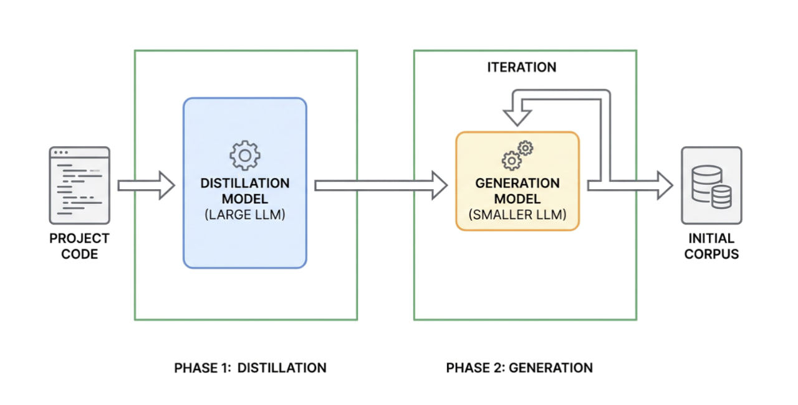

# LLM-Powered Go Fuzzing

Инструмент для автоматического фаззинга Go-кода с использованием больших языковых моделей.

## Описание

Проект использует двухфазный подход для генерации initial corpus:

1. **Фаза дистилляции**: Первая LLM анализирует исходный код Go и извлекает:
   - Описание функциональности
   - Формат входных данных
   - Примеры валидных входов
   - Edge cases и потенциально проблемные входы
   - Рекомендации по максимизации code coverage

2. **Фаза генерации**: Вторая LLM генерирует разнообразные тестовые входы на основе результатов дистилляции, итеративно расширяя corpus.



Сгенерированный corpus можно использовать с инструментами фаззинга, такими как [go-118-fuzz-build](https://github.com/AdamKorcz/go-118-fuzz-build) или нативным Go fuzzing.

## Необходимые зависимости
```bash
pip install torch transformers
```

## Запуск (находится в fuzz.ipynb)
```python
results, distillations = run_two_phase_pipeline(
    base_dir="memos",
    file_groups=FUZZ_FILE_GROUPS,
    distill_model_name="Qwen/Qwen3-4B",
    gen_model_name="Qwen/Qwen3-1.7B",
    iterations=6,
    inputs_per_iter=20
)
```

## Конфигурация


### Определение целей для фаззинга

Параметр `base_dir` отвечает за корень проекта для фаззинга.

Группы файлов для анализа задаются в `FUZZ_FILE_GROUPS`, протестированы для следующих файлов:
```python
FUZZ_FILE_GROUPS = {
    "filter": {
        "files": ["plugin/filter/parser.go", "plugin/filter/engine.go"],
    },
    "url": {
        "files": ["plugin/httpgetter/html_meta.go"],
    },
    "email": {
        "files": ["internal/util/util.go"],
    },
    "uid": {
        "files": ["internal/base/resource_name.go"],
    },
}
```

### Остальные параметры `run_two_phase_pipeline`

| Параметр | Тип | По умолчанию | Описание |
|----------|-----|--------------|----------|
| `distill_model_name` | str | `"Qwen/Qwen3-1.7B"` | Название модели (в библиотеке transformers) для фазы дистилляции |
| `gen_model_name` | str | `"Qwen/Qwen3-1.7B"` | Название модели для фазы генерации корпуса |
| `iterations` | int | `6` | Количество итераций генерации для каждой цели, рекомендуется оставить 6 |
| `inputs_per_iter` | int | `20` | Количество входов, генерируемых за одну итерацию |


## Выходные данные

При запуске `fuzz.ipynb` программа выводит отладочную информацию о прогрессе, примерно в таком формате:
```
============================================================
PHASE 1: DISTILLATION
============================================================
--- Distilling: filter ---
  Files: ['plugin/filter/parser.go', 'plugin/filter/engine.go']
  Name: CEL Filter Parser
  Input type: string
  Examples: 5
  Edge cases: 6
  Description: 547 chars

============================================================
PHASE 2: CORPUS GENERATION
============================================================
--- Generating corpus: CEL Filter Parser (filter) ---
  Starting with 11 seed inputs from distillation
  Iteration 1/6...
    Generated 18 inputs, added 9 new, total: 20
  Iteration 2/6...
    Generated 17 inputs, added 10 new, total: 30
  Iteration 3/6...
    Generated 23 inputs, added 10 new, total: 40
  Iteration 4/6...
    Generated 21 inputs, added 8 new, total: 48
  Iteration 5/6...
    Generated 29 inputs, added 15 new, total: 63
  Iteration 6/6...
    Generated 22 inputs, added 4 new, total: 67
Saved 67 inputs to corpus/filter
  Generated 67 unique inputs
```

### Структура выходных файлов
```
./
├── corpus/                      # Сгенерированный initial corpus
│   ├── filter/
│   │   ├── input_0000
│   │   ├── input_0001
│   │   └── ...
│   ├── url/
│   └── ...
├── fuzzing_results.json         # Результаты генерации
└── distillation_results.json    # Результаты дистилляции
```

- `corpus/<target>/` — директория с файлами входных данных для каждой цели фаззинга. Каждый файл содержит один тестовый вход
- `fuzzing_results.json` — JSON с метаданными и примерами сгенерированных входов
- `distillation_results.json` — полные результаты анализа кода моделью

### Стратегия генерации по итерациям

Каждая итерация фокусируется на определённом типе входов:

| Итерация | Акцент итерации |
|----------|-------|
| 1 | Базовые валидные входы, простые вариации |
| 2 | Максимизация покрытия кода |
| 3 | Unicode, спецсимволы, escape-последовательности |
| 4 | Некорректные входы, синтаксические ошибки |
| 5 | Security payloads, инъекции, обходы валидации |
| 6 | Граничные условия, пустые/очень длинные входы |

## Использование с go-118-fuzz-build

Для фаззинга с данным initial corpus в директории project/your_corpus можно воспользоваться утилитой [go-118-fuzz-build](https://github.com/AdamKorcz/go-118-fuzz-build).

После компиляции фаззинг теста:
```bash
$ ./fuzz_binary project/your_corpus
```

**Важно:** Входные тесты, сгенерированные в процессе фаззинга, будут сохраняться в ту же директорию `project/your_corpus`, поэтому рекомендуется сделать резервную копию вашего initial corpus перед запуском фаззинга.